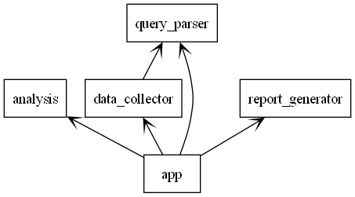

# LLM Industry Intelligence Report Generator

An end-to-end automated market intelligence system that transforms natural language queries into professional industry reports.

## End-to-End Pipeline

- **Natural Language Query Processing**  
  Accepts business-level questions (e.g., "EV market in Spain 2024")
  
- **Automated Market Research**  
  Integrates web scraping + API data collection

- **AI-Powered Analysis**  
  GPT-4 based trend analysis and insight generation

- **Executive-Grade Reporting**  
  Generates board-ready reports with:
  - Market trends analysis
  - Competitive landscape
  - Strategic recommendations
  - Risk assessment  

### System Arquitecture

  

